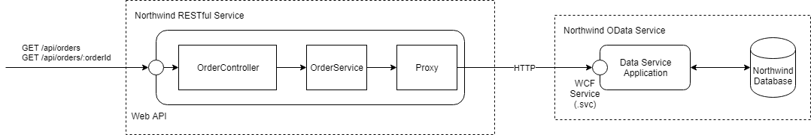

# Northwind Data Services

## Задача 2 - Northwind Web App

Цели:
* Научиться создавать веб-приложения, используя ASP.NET Core.
* Научиться создавать базовый CRUD RESTful API.
* Научиться использовать версионированный API.
* Научиться документировать API.
* Научиться размещать веб-приложения на платформе Heroku.


### Создание базового приложения ASP.NET Core



| Endpoint             | Http Verb | Status Codes |
| -------------------- | --------- | ------------ |
| /api/orders          | GET       | 200, 500     |
| /api/orders/:orderId | GET       | 200, 500     |


#### Материалы для изучения

* [Create web APIs with ASP.NET Core](https://docs.microsoft.com/en-us/aspnet/core/web-api/?view=aspnetcore-2.2)
* [Tutorial: Create a web API with ASP.NET Core](https://docs.microsoft.com/en-us/aspnet/core/tutorials/first-web-api?view=aspnetcore-2.2&tabs=visual-studio)
* [How to: Add Query Options to a Data Service Query (WCF Data Services)](https://docs.microsoft.com/en-us/dotnet/framework/data/wcf/how-to-add-query-options-to-a-data-service-query-wcf-data-services)


#### Выполнение

1. Создайте новое приложение ASP.NET Core:

```
mkdir northwind-basic-app
cd northwind-basic-app
dotnet new webapi -n NorthwindWebApiApp
dotnet new sln -n NorthwindBasicApp
dotnet sln NorthwindBasicApp.sln add NorthwindWebApiApp\NorthwindWebApiApp.csproj
dotnet add NorthwindWebApiApp\NorthwindWebApiApp.csproj package Microsoft.Data.Services.Client
dotnet build
dotnet run --project NorthwindWebApiApp
```

2. Добавьте в проект файлы:

* [OrdersController](task02/northwind-basic-app/NorthwindWebApiApp/Controllers/OrdersController.cs) в папку Controllers.
* [BriefOrderModel.cs](task02/northwind-basic-app/NorthwindWebApiApp/Models/BriefOrderModel.cs) и [FullOrderModel.cs](task02/northwind-basic-app/NorthwindWebApiApp/Models/FullOrderModel.cs) в папку Models.
* [IOrderService.cs](task02/northwind-basic-app/NorthwindWebApiApp/Services/IOrderService.cs) и [OrderService.cs](task02/northwind-basic-app/NorthwindWebApiApp/Services/OrderService.cs) в папку Services.
* Поместите [NorthwindDataService.cs](task02/northwind-basic-app/NorthwindWebApiApp/ExternalServices/NorthwindDataService.cs) (версия 3) в папку External Services.

3. Зарегистрируйте сервис в [Startup.cs](task02/northwind-basic-app/NorthwindWebApiApp/Startup.cs):

```cs
public void ConfigureServices(IServiceCollection services)
{
	services.AddMvc().SetCompatibilityVersion(CompatibilityVersion.Version_2_2);
	services.AddScoped<IOrderService, OrderService>();
}
```

4. Запустите и проверьте работоспособность приложения.


### Конфигурация сервиса

#### Материалы для изучения

#### Выполнение


### Документирование сервиса

#### Материалы для изучения

* [ASP.NET Core web API help pages with Swagger / OpenAPI](https://docs.microsoft.com/en-us/aspnet/core/tutorials/web-api-help-pages-using-swagger)
* [Get started with Swashbuckle and ASP.NET Core](https://docs.microsoft.com/en-us/aspnet/core/tutorials/getting-started-with-swashbuckle)


#### Выполнение 

TODO


### Версионирование API

#### Материалы для изучения

* [ASP.NET API Versioning](https://github.com/microsoft/aspnet-api-versioning)
* [New Services Quick Start](https://github.com/microsoft/aspnet-api-versioning/wiki/New-Services-Quick-Start#aspnet-core)


#### Выполнение

TODO


#### Ведение журнала работы сервиса (логирование)

#### Материалы для изучения

* [Logging in ASP.NET Core](https://docs.microsoft.com/en-us/aspnet/core/fundamentals/logging)
* [Логгирование](https://metanit.com/sharp/aspnet5/2.10.php)
* [Логгирование в ASP.NET Core](https://blog.zwezdin.com/2017/asp-net-core-logging/)
* [Логирование как способ отлаживать код](https://habr.com/ru/post/354962/)
* [Структурное логирование на примере Serilog и Seq](https://habr.com/ru/post/266299/)
* [Документация serilog](https://serilog.net/)

#### Выполнение

TODO


### Размещение сервиса

* Размещение сервиса на heroku.
* Размещение сервиса на Azure Web App.


### Проектирование CRUD API

#### Материалы для изучения

https://www.restapitutorial.com/index.html
https://restfulapi.net/


#### Выполнение

TODO


### Подключение базы данных

#### Материалы для изучения

* PostgreSQL
* Entity Framework


#### Выполнение

TODO


### Использование Automapper

#### Материалы для изучения

#### Выполнение


### Использование внешнего DI-контейнера (повышенная сложность)

#### Материалы для изучения

* [Using Autofac Instead of Inbuilt DI Container in Asp.Net Core MVC](http://www.codedigest.com/posts/49/using-autofac-instead-of-inbuilt-di-container-with-in-aspnet-core-mvc)
* [Replacing the Inbuilt DI Container with StructureMap in Asp.Net Core MVC](http://www.codedigest.com/posts/40/replacing-the-inbuilt-di-container-with-structuremap-in-aspnet-core-mvc)
* [Configuration Comparison of Dependency Injection Containers (IOC)](https://codingsight.com/configuation-comparison-dependency-injection-containers/)
* [.NET Core project without Autofac. Is it viable?](https://alex-klaus.com/webapi-proj-without-autofac/)